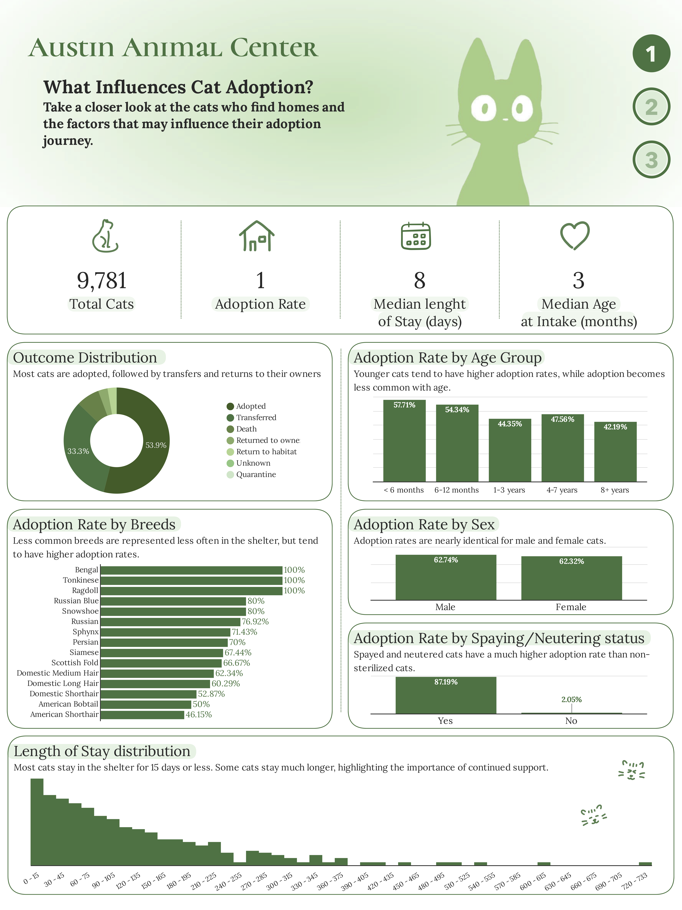
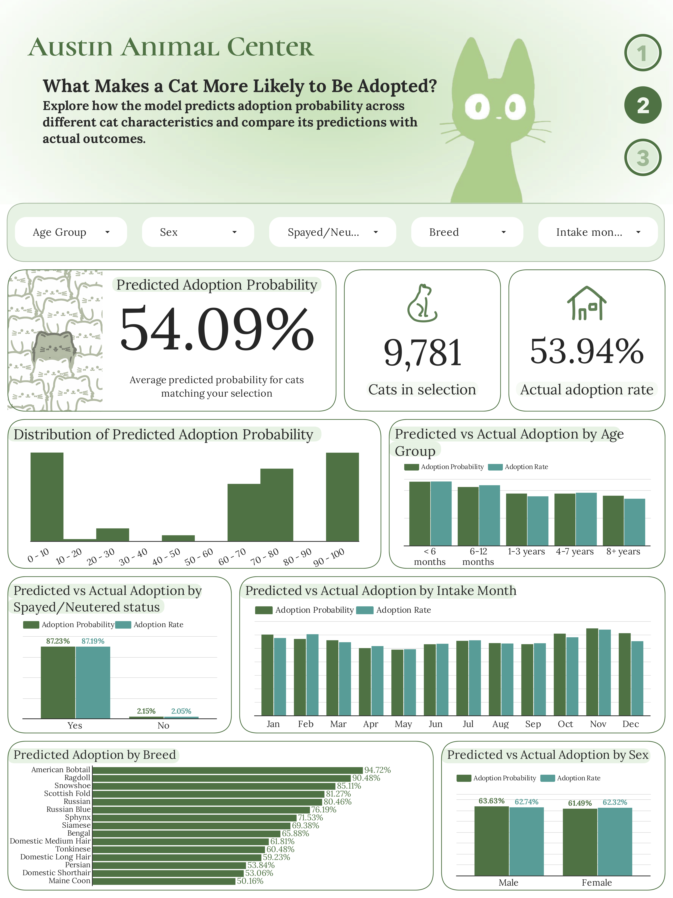
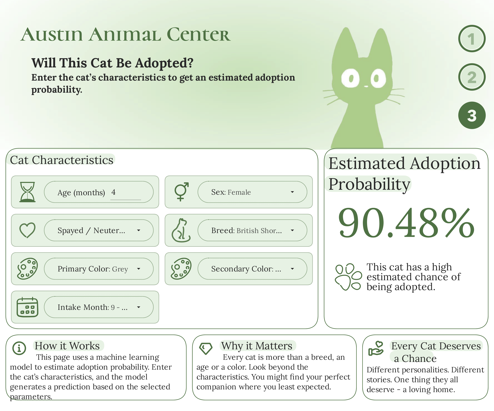

# Austin Animal Center: Cat Adoption Analytics & Prediction

What influences whether a shelter cat gets adopted? This project uses the [Austin Animal Center](https://catalog.data.gov/dataset/austin-animal-center-outcomes) intake and outcome dataset to explore adoption patterns, build a machine learning model that predicts adoption probability and deploy a live prediction tool directly inside an interactive Looker Studio report.

## 🔗 Live dashboard

[Looker Dashboard](https://datastudio.google.com/reporting/3dbf7f8b-cd33-4d54-a28a-aadab8695273)

### 📊 Dashboard Preview





## 📓 Google Colab Notebooks

[Cat Adoption Prediction](https://colab.research.google.com/drive/1AjHtvDagpL3q6PncUwvrqyoW99oXM6Bu?usp=sharing)

---

## 📌 Project goals

- Explore which cat characteristics (age, breed, sex, spay/neuter status, intake timing) are associated with adoption outcomes at a real municipal shelter.

- Build and validate model that estimates adoption probability.

- Deploy the trained model as a live API and connect it to the dashboard, so a visitor can enter a hypothetical cat's characteristics and get a real-time predicted probability - not a pre-computed lookup table.

---

## 🗂️ Repository structure

This project spans two repositories:

**This repo** - data analysis, EDA, model training/comparison and the dashboard.

[cat-adoption-model-api](https://github.com/karinababii0/cat-adoption-api.git) - the trained model packaged as a FastAPI service, deployed on Render.com, exposing a `/predict` endpoint.

```
├── notebooks/
│   └── cat_adoption.ipynb
│
├── data/
│   ├── raw/
│   │   └── exported.csv
│   └── processed/
│       └── cat_adoption.csv
│
├── images/
│   ├── what_influences_cat_adoption.png
│   ├── what_makes_a_cat_more_likely_to_be_adopted.png
│   └── will_this_cat_be_adopted.png
│
└── README.md
```

---

## 🧱 Project Architecture

```
Austin Animal Center data
        │
        ▼
   Google Colab
        │
        ├── Data cleaning
        ├── EDA
        ├── Feature engineering
        ├── Model training
        └── Model evaluation
                │
                ▼
          Trained model
                │
                ▼
         Prediction API
             (Render)
                │
                ▼
         Google Apps Script
         Community Connector
                │
                ▼
  Looker Studio with Live prediction
```

---

## 🛠️ Tech stack

- **Python** - Google Colab
- **Looker Studio** - dashboard, data visualization and live prediction tool
- **Render.com** - free-tier API hosting
- **Google Apps Script** — custom Community Connector acting as a bridge between Looker Studio and the external API
---

## 📊 Dashboard pages

| Page | Metrics |
| :--- | :--- |
| What Influences Cat Adoption? | Descriptive story: outcome distribution, adoption rate by age group, breed, sex, spay/neuter status, length of stay distribution |
| What Makes a Cat More Likely to Be Adopted? | Model's-eye view: predicted adoption probability distribution, predicted vs. actual adoption rate by age/breed/sex/intake month |
| Will This Cat Be Adopted? | Live calculator: enter a cat's characteristics, get a real-time predicted probability |
---

## 🔍 Key findings

1. **Sterilization status is the most significant factor in the model’s predictions**. An analysis of feature importance in the final Decision Tree shows that the feature "Sterilized/Neutered = Yes" accounts for 92.6% of the total feature importance, while "Age at Intake" ranks second at 6.4%. Almost all other features - breed, coat color, sex and month of intake make a minimal contribution to the prediction.

      Therefore, the behavior of the final model closely approximates a single-factor rule rather than a complex combination of many characteristics. During our analysis, we also explored alternative models, including Logistic Regression with Ridge regularization, which distributed importance across a larger number of features. However, for the final model we focused primarily on Recall, Precision and F1-score, rather than just the distribution of feature importance. The Decision Tree was selected based on its performance on key metrics, despite the strong concentration of importance in a single feature.


2. **Neutered cats are adopted significantly more often** (87.19%) than unneutered cats (2.05%) - the largest difference observed among the analyzed characteristics.

3. **Younger cats are adopted more frequently**, with the adoption rate declining fairly evenly from 57.71% (up to 6 months old) to 42.19% (8 years and older).

4. **Less common breeds are adopted more frequently** - this likely reflects their rarity or appeal, although the sample sizes for these breeds are small.

5. **Gender shows very little difference in adoption rates** (62.74% for males vs 62.32% for females).

6. **Most cats are adopted within 15 days**, but a significant number remain in the shelter for much longer, indicating a subgroup that may require targeted support (medical care, less "attractive" profiles).

---
## ⚠️ Known limitations

- The deployed model was not retrained on the full dataset after model selection. The final Decision Tree was trained on the combined training and validation sets (70% of the data), while the remaining 30% was set apart as a separate test set for an objective validation of performance. After selecting the model and hyperparameters, we did not perform an additional final training step on 100% of the available data before deployment. Therefore, the deployed model does not use all available training examples. The reported test set metrics (accuracy 92.3%, precision 88.18%, recall 98.99% and F1 93.27%) remain an adequate assessment of its generalization ability.
- The breed and coat color data entered into the online calculator (page 3) may have a limited impact on the result, since the importance of the selected model’s features is most heavily influenced by spay/neuter status and age - changing the breed or coat color for an otherwise identical cat is unlikely to significantly change the predicted probability.
- Render.com free tier plan may enter "sleep" mode after a period of inactivity - the online calculator on page 3 may respond with a delay of up to ~60 seconds after a period of inactivity or it may briefly display an error if the request times out before the system "wakes up".
- The sample sizes for rare breeds are small, so the high adoption rates reported for them should be interpreted with caution.
